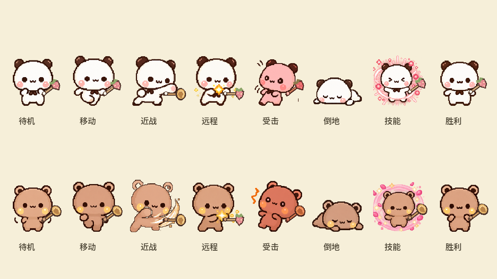
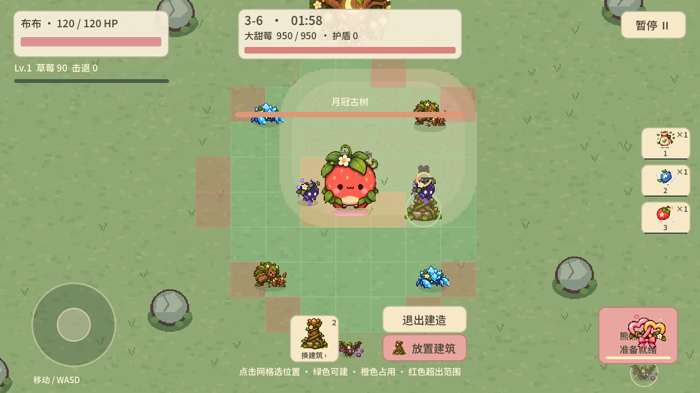
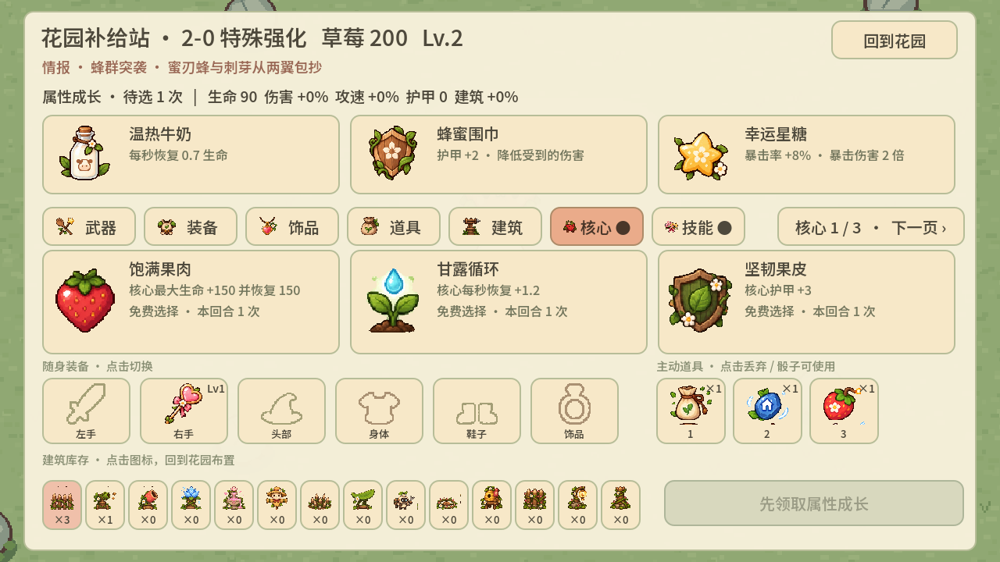
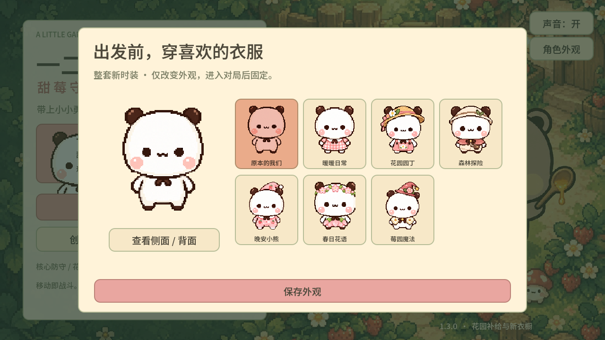
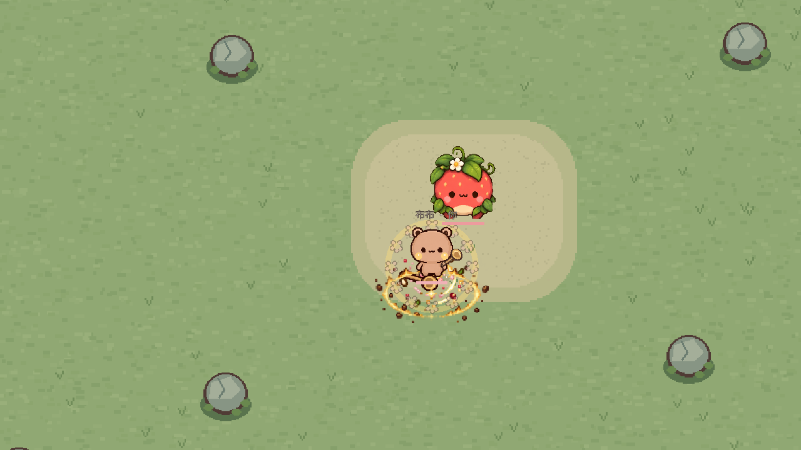

# 一二布布甜莓守护战

**一二布布甜莓守护战**是一款以一二和布布为主角的俯视角像素风 Roguelite。带上小小勇气，在花园里守护大甜莓；可单人游玩，也可在同一局域网和朋友合作。

**当前版本：v1.5.0 · Godot 4.7.2 · Android 横屏**

[下载最新版本](https://github.com/sharbvane/bubu12game/releases/latest) · [查看更新日志](docs/v1.5.0.md) · [报告问题](https://github.com/sharbvane/bubu12game/issues)

## 游戏画面

以下图片由本项目 Godot 场景和渲染检查实际生成。战斗与补给截图来自 v1.4 场景检查，角色动作与特效来自 v1.5。

| 角色逐帧动作（v1.5） | 战斗、Boss 与建造网格 |
| --- | --- |
|  |  |

| 回合间大甜莓强化补给 | 主菜单衣橱 |
| --- | --- |
|  |  |

| v1.5 战斗特效渲染 |
| --- |
|  |

## 玩法特色

- 三个大回合、十八个小波次；每波后进入花园补给站，Boss 波后结算并开启专属核心强化。
- 一二擅长远程与治疗，布布擅长近战与防护；靠近时获得情侣协作效果，倒地后可以互相救援。
- 多种武器、装备、饰品、主动道具、建筑、敌人和 Boss；建造时显示网格与占用状态。
- 主菜单可以继续本机存档；完成大回合后自动保存成长、装备、库存与大甜莓强化。
- image2.5 制作的八帧像素动画用于角色、时装、主要敌人与 Boss；战斗模拟仍由房主权威处理。

## 安装与操作

从 [GitHub Releases](https://github.com/sharbvane/bubu12game/releases/latest) 下载最新 Android APK，在设备上安装。首次安装可能需要允许浏览器或文件管理器安装未知来源应用。更新包沿用同一 Android 包名与签名，可覆盖安装并保留应用数据。

手机采用横屏布局：左侧虚拟摇杆移动，右侧按钮使用技能/道具或放置建筑，右上角暂停。电脑可使用 **WASD** 移动、**空格**使用技能、**Esc**暂停；武器自动攻击。

## 双人局域网

两台设备安装相同版本并连接同一 Wi-Fi。在主菜单由一位玩家创建房间，另一位打开房间列表并点击房间加入；不需要输入 IP。主机负责战斗模拟与状态同步。局域网房间发现使用 UDP **28713**，ENet 游戏连接使用 UDP **28712**。访客网络隔离、防火墙或路由器禁用广播时，设备可能无法互相发现。

## 项目结构

| 目录 | 内容 |
| --- | --- |
| scenes/、scripts/ | 主场景、游戏入口、数据目录与战斗模拟 |
| characters/、enemies/、weapons/、items/ | 角色、敌人、武器和道具表现 |
| multiplayer/ | LAN 房间发现、ENet 会话和同步 |
| ui/ | 主菜单、补给站、HUD 和触控输入 |
| 资产/精灵/、资产/动画/、audio/ | 游戏运行所需像素美术、动画和声音 |
| 资产/原画/、tools/ | 图集源图与资源处理/生成脚本 |
| tests/ | 模拟、动画、联机与界面检查 |
| .github/workflows/ | Android 构建与版本 Release 自动化 |

新增内容优先扩展 scripts/catalog.gd 与 scripts/garden_content.gd 中的数据；新增行为再接入 scripts/simulation.gd。角色外观和动画由 characters/ 管理，敌人表现由 enemies/ 管理，房间同步由 multiplayer/ 管理。

## 本地开发与检查

安装 [Godot 4.7.2 Standard](https://github.com/godotengine/godot/releases/tag/4.7.2-stable)，打开 project.godot 并运行主场景。项目使用 Godot Compatibility 渲染器。

Windows PowerShell 可设置本机 Godot 可执行文件后运行集成检查：

    $env:GODOT_BIN = 'C:\Godot\Godot_v4.7.2-stable_win64_console.exe'
    python tools\run_checks.py

Android 本地导出需 OpenJDK 17、Android SDK Platform 35、Build Tools 35.0.1 以及 Godot 4.7.2 Android 导出模板。更简单的方式是推送到 main，从 Actions 下载构建 APK。

## 自动构建与发布

- 推送到 main 或在 Actions 手动运行 **Android APK**：构建签名 APK，提供 30 天有效的测试构建和构建日志。
- 发布版本时，更新 export_presets.cfg 中的 version/name 与递增后的 version/code，添加 docs/vX.Y.Z.md 更新说明，再推送匹配的 vX.Y.Z 标签。工作流会先构建并校验 APK，然后创建正式 Release。
- 工作流使用 GitHub Actions Secrets 中的原签名密钥和密码。密钥文件与密码不会提交到仓库；不要更换原签名密钥，否则现有安装无法直接覆盖更新。

    git add .
    git commit -m "Release v1.6.0"
    git push origin main
    git tag v1.6.0
    git push origin v1.6.0

版本标签必须与 export_presets.cfg 中的版本号完全一致。Release 更新日志来自同版本的 docs/vX.Y.Z.md。

## 许可证与素材来源

原创源码按仓库中的 [LICENSE](LICENSE) 使用 MIT 许可。该许可**不包含**游戏图像、动画、音频、截图或参考图。字体 Noto Sans SC 使用 SIL Open Font License 1.1；其他素材的生成来源及许可边界见 [ASSET_LICENSES.md](ASSET_LICENSES.md) 和 [assets_sources.md](assets_sources.md)。来源不明的素材不会被本仓库重新授予许可。

## English

**Yier & Bubu: Sweetberry Defense** is a top-down pixel-art roguelite starring two teddy-bear partners. Defend the garden and its giant strawberry alone or together over a local network.

**Current release: v1.5.0 · Godot 4.7.2 · Android landscape**

[Download the latest release](https://github.com/sharbvane/bubu12game/releases/latest) · [v1.5.0 notes](docs/v1.5.0.md) · [Report an issue](https://github.com/sharbvane/bubu12game/issues)

### Screenshots

These images were rendered by this project's Godot scenes and visual checks. The combat and supply UI images come from v1.4 scene checks; the animation and effects images are from v1.5.

| Character frame animations (v1.5) | Combat, boss and build grid |
| --- | --- |
|  |  |

| Giant-strawberry upgrade camp | Wardrobe |
| --- | --- |
|  |  |

### Features

- Three rounds and eighteen waves, with a garden supply camp after each wave and dedicated core upgrades between rounds.
- Yier focuses on ranged attacks and healing; Bubu focuses on melee and defense. Partner proximity and revive mechanics reward cooperation.
- Multiple weapons, equipment, charms, active items, buildings, enemy types and bosses; placement mode shows the build grid and occupied cells.
- Local save continuation after each completed round, including equipment, inventory, upgrades and giant-strawberry progress.
- Eight-frame pixel animations for the bears, outfits, main enemies and bosses. The host remains authoritative for combat simulation.

### Install and controls

Download the latest Android APK from [GitHub Releases](https://github.com/sharbvane/bubu12game/releases/latest) and install it on Android. The package name and signing key remain compatible with previous builds, so an update can be installed over the existing app while keeping its app data.

On mobile, use the left virtual stick to move, the right-side buttons for skills/items/building, and the top-right button to pause. On desktop, use **WASD**, **Space** for the skill, and **Esc** to pause. Weapons attack automatically.

### Local multiplayer

Install the same game version on both devices and connect them to the same Wi-Fi network. One player creates a room; the other taps it in the discovered room list. No IP entry is required. The host owns the simulation. Room discovery uses UDP **28713** and ENet gameplay uses UDP **28712**. Guest-network isolation, firewalls or disabled broadcast can prevent discovery.

### Development

Open project.godot with [Godot 4.7.2 Standard](https://github.com/godotengine/godot/releases/tag/4.7.2-stable). The project uses the Compatibility renderer. Set GODOT_BIN and run python tools/run_checks.py to execute the existing integration checks.

For Android export, install OpenJDK 17, Android Platform 35, Build Tools 35.0.1 and the matching Godot Android export templates. Alternatively, push to main and download the APK from the **Android APK** workflow.

### Project structure

| Directory | Contents |
| --- | --- |
| scenes/, scripts/ | Main scene, game entry point, data catalogs and combat simulation |
| characters/, enemies/, weapons/, items/ | Character, enemy, weapon and item visuals |
| multiplayer/ | LAN discovery, ENet session and state synchronization |
| ui/ | Main menu, supply camp, HUD and touch controls |
| 资产/精灵/, 资产/动画/, audio/ | Runtime pixel art, animation and sound |
| 资产/原画/, tools/ | Source art sheets and asset processing/generation tools |
| tests/ | Simulation, animation, multiplayer and UI checks |
| .github/workflows/ | Android build and tagged release automation |

### CI and releases

Pushes to main and manual workflow runs produce a signed APK artifact and retained build logs. To publish a release, bump version/name and version/code in export_presets.cfg, add docs/vX.Y.Z.md, then push a matching vX.Y.Z tag. The workflow validates the tag and signed APK before creating the GitHub Release.

The signing keystore and password are stored as GitHub Actions Secrets and are never committed. Keep the same keystore for upgrades. The release notes are taken from docs/vX.Y.Z.md.

### License and assets

Original source code is MIT-licensed as scoped in [LICENSE](LICENSE). Game art, animation, audio, screenshots and reference images are excluded from that grant. Noto Sans SC is distributed under SIL Open Font License 1.1. See [ASSET_LICENSES.md](ASSET_LICENSES.md) and [assets_sources.md](assets_sources.md) for provenance and asset-specific terms. Assets with unverified provenance are not relicensed by this repository.
